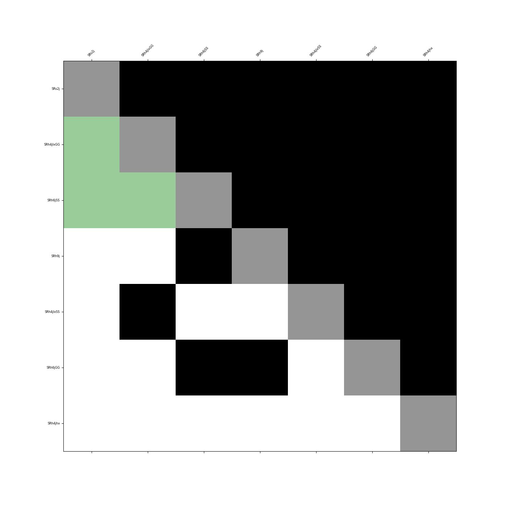

# SATACO


On top tool for Simple Analysis (SA) implementing algorithms from 
Testing Analyses' COrrelations (TACO).
[SimpleAnalysis](https://simpleanalysis.docs.cern.ch)
[TACO](https://gitlab.com/t-a-c-o/)

## Purpose and General Functionality

Give a proof of concept of the paper: <br>

[Strength in numbers: optimal and scalable combination of LHC new-physics searches](https://arxiv.org/abs/2209.00025)<br>
The paper states that to discover new physics beyond the SM, it will be 
necessary to combine multiple SR of different analyses, because new physics 
will not leave a siginificant signature in one channel but will disperse over many.<br>
The combination of SR is not trivial since the analyses are not statistically 
orthogonal and therefore have a nono zero correlation coefficient.<br>
Correlating SRs cannot be combined. The goal is now to define correlations 
matrices of the SRs and find the best combination of mulitple SRs. 
This process is not done combinatorically due to the increasingly fast rising 
numbers of possibilities, but via a longest path method in a _Directed Acyclic Graph (DAG)_. <br>
After finishing, the program provides the user with visual, text and pure data results.<br>


## Get Started

### 1. Clone the git repository to your local machine

```sh
git clone https://github.com/leonrenn/SATACO.git
```


### 2. Change into the repository and install the requirements

To install the requirements do:
```sh
cd SATACO && pip install -r requirements.txt
```

### 3. Start with the tool
For this step it is necessary that you already generated data with the SA tool.<br>
Do not forget to set the flag [-n] in SA which provides the analysis result with a
ntuple. After that you can move the data (.root-files) from the analysis into your 
SATACO repository.<br>

Now you can use the tool in two ways:

1. With the -r flag which you can provide with mulitple comma seperated root files:
```sh
python src/main.py -r data/"your_data_1.root","your_data_2.root"
```

2. ​With the -d flag which you can provide a hole directory with:
```sh
python src/main.py -d data
```

## Results

- event_SR.parquet (gzip compressed): Events in every single Signal Region that at least accepted one event of the data.
- SR_SR.parquet (gzip compressed): Matrix of Signal Regions. Elements where compared and afterwards summed up for different Signal Regions.
- correlations.parquet (gzip compressed): Pearson correlation matrix for the SR_SR matrix.
- SR_SR.png: Figure of the correlations between the Signal Regions.
- correlations_threshold.png: Figure of correlations of Signal Regions with applied threshold for dividing them into: correlated and uncorrelated.
- correlations_path.png: Figure of correaltion matrix with elements marked in green that are part of the best SR combination (top 1 path).
- signal_regions.txt: Text file of all signal regions used in the current analysis run.
- best_SR_comb.txt: Best combination of mulitple paths (sorted).


correlations_path.png

Shows all uncorrelated SRs in green that build up the best possible combination of all SRs.
